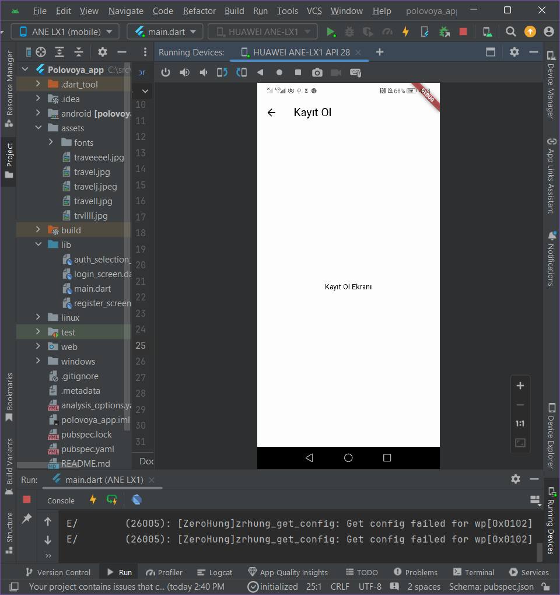

<H1>Takım İsmi</H1>
<H4>Flutter 66</H4>

<H1>Ekip ve Ürün Hakkında Bilgiler</H1>
<H2>Takım Elemanları</H2>
Ceren Efe : Product Owner , Developer  
Medya Doran : Scrum Master , Developer  
Melisa Sadioğlu : Designer , Developer  
Hasip Tekin : Marketing , Developer
<!DOCTYPE html>
<html lang="en">
<head>
    <meta charset="UTF-8">
    <meta name="viewport" content="width=device-width, initial-scale=1.0">
    <title>Team Members</title>
    <link rel="stylesheet" href="styles.css">
</head>
<body>
    <table>
        <thead>
            <tr>
                <th>Name</th>
                <th>Title</th>
                <th>Socials</th>
            </tr>
        </thead>
        <tbody>
            <tr>
                <td>Ceren Efe</td>
                <td>Product Owner , Developer</td>
                <td>
                    
                </td>
            </tr>
            <tr>
                <td>Medya Doran</td>
                <td>Scrum Master , Developer</td>
                <td>
                    
                </td>
            </tr>
            <tr>
                <td>Melisa Sadioğlu</td>
                <td>DDesigner , Developer</td>
                <td>
                    
                </td>
            </tr>
            <tr>
                <td>Hasip Tekin</td>
                <td>Marketing , Developer</td>
                <td>
                    
                </td>
            </tr>
        </tbody>
    </table>
</body>
</html>

<H1>Ürün İsmi</H1>
<h2>Polovoya </h2>

<h1>Ürün Açıklaması</h1>
Yabancı dilini geliştirmek isteyenler için, turist rehberi veya dil konusunda yetkin kişilerin, ücretsiz ya da belirledikleri bir ücret karşılığında turistlere rehberlik ederek seyahat bilgileri sunduğu bir proje geliştirdik. Bu proje ile turistler, bütçelerine veya konfor tercihlerine göre kendi rehberlerini seçebilirler. Aynı zamanda, bu proje sayesinde turistlerin seyahat rotalarına da destek sağlıyoruz.

<h1>Ürün Özellikleri</h1>
<h4><H3>1-)Rehber Seçimi: </H3>Turistler, bütçelerine ve konfor tercihlerine göre yerel rehberleri seçebilirler. Rehberlerin profilleri, dil becerileri ve uzmanlık alanları hakkında detaylı bilgi içerir.
<H3>2-) Dil Pratiği ve Kültürel Deneyim: </H3>Yabancı dilini geliştirmek isteyenler için, pratik yapma ve yerel kültürü tanıma fırsatı sunar. Rehberler, dil konusunda yetkin kişiler arasından seçilir.
<H3>3-) Esnek Ücretlendirme:</H3> Rehberler, hizmetleri için belirledikleri ücretleri kendileri belirlerler. Ayrıca, ücretsiz rehberlik sunan gönüllüler de bulunabilir.
<H3>4-) Seyahat Rotası Desteği:</H3> Proje, turistlerin seyahat rotalarını planlamalarına ve optimize etmelerine yardımcı olur. Rehberler, en iyi yerel mekanları ve aktiviteleri önerir.
<H3>5-) Kullanıcı Geri Bildirimleri:</H3> Turistler ve rehberler, birbirleri hakkında geri bildirimde bulunabilirler. Bu, gelecekteki kullanıcılar için güvenilir rehberler ve kaliteli deneyimler seçmelerine yardımcı olur. </h4>h4>

<H1>Hedef Kitle</H1>
<H2>Dil öğrenenler: </H2>
Yabancı bir dilde pratik yapmak isteyenler.  
Yerel kültürü doğrudan deneyimlemek isteyenler.  
Yeni insanlarla tanışarak dil becerilerini geliştirmek isteyenler.  

<H2>Rehberler: </H2>
Yerel bilgi ve deneyimlerini paylaşmaktan hoşlananlar.  
Turistlere yerel alanlarda rehberlik yaparak kazanç elde etmek isteyenler.  
Farklı kültürleri ve insanları tanımak isteyenler.  
Proje Yapılandırması ve Gereksinim Tanımlaması.  

<H1>Sprint Notes</H1>

  
<h2>Proje Yapılandırması ve Gereksinim Tanımlaması</h2> 
Proje gereksinimlerini ve yapılandırmasını belirleme  
Geliştirme ortamının kurulumu  
Depo ve proje yönetim araçlarının kurulumu (Git, Jira vb.)  
  
<h2>Kullanıcı Arayüzü Tasarımı</h2>
Giriş ve kayıt ekranlarının tasarlanması  
UX/UI tasarım prensiplerine uygun mockup'ların oluşturulması  
Tasarımların onaylanması  
  
</h2>Kullanıcı Kayıt Sistemi Geliştirme</h2>
Firebase veya benzeri bir arka uç hizmeti entegrasyonu  
Kullanıcı kayıt formunun ve doğrulamasının geliştirilmesi  
Yeni kullanıcı hesaplarının oluşturulması ve veritabanında saklanması  
  
<h2></h1>Kullanıcı Giriş Sistemi Geliştirme</h2>
Kullanıcı giriş formunun ve doğrulamasının geliştirilmesi  
Kullanıcı kimlik doğrulamasının ve oturum yönetiminin uygulanması  
Sosyal medya giriş seçeneklerinin entegrasyonu (Facebook, Google, Apple)  
  
<h2>Kullanıcı Arayüzü ve Arka Uç Entegrasyonu</h2>
Arayüz ve arka uç arasında veri alışverişinin sağlanması  
Kullanıcı kayıt ve giriş süreçlerinin test edilmesi  
Hataların düzeltilmesi ve iyileştirmelerin yapılması  
  
<h2>Testler ve Sprint İncelemesi</h2>
Fonksiyonel testlerin yapılması  
Kullanıcı geri bildirimlerinin toplanması  

<h2>Sprint retrospektifi:</h2>  
İyi gidenlerin ve iyileştirilmesi gereken alanların gözden geçirilmesi  
Bir sonraki sprint için plan yapılması  

<h1>Uygulama Durumu</h1>
Uygulamamızın geliştirilmesi sürecinde önemli aşamalar kaydedilmiştir. İlk olarak, kullanıcıların uygulamaya hızlı ve kolay bir şekilde erişimini sağlayacak olan giriş ekranı ve anasayfa tamamlanmıştır. Bu ekranlar, kullanıcı dostu bir arayüz ve sezgisel navigasyon sunarak, kullanıcıların ihtiyaçlarını karşılamayı hedeflemektedir.

Şu anda, uygulamanın geri kalan önemli bölümleri üzerinde yoğun bir şekilde çalışılmaktadır. Özellikle, kullanıcıların giriş yapmalarını ve yeni hesap oluşturmalarını sağlayacak olan giriş sayfası ve kayıt ol sayfası yapılma aşamasındadır. Bu sayfalar tamamlandığında, kullanıcılar uygulamaya güvenli bir şekilde giriş yapabilecek ve yeni hesap oluşturabileceklerdir.

Geliştirme süreci planlandığı gibi ilerlemekte olup, tüm bu özelliklerin yakın zamanda tamamlanarak kullanıcılara sunulması hedeflenmektedir. Güncellemelerle ilgili gelişmeleri sizinle paylaşmaya devam edeceğiz.  

